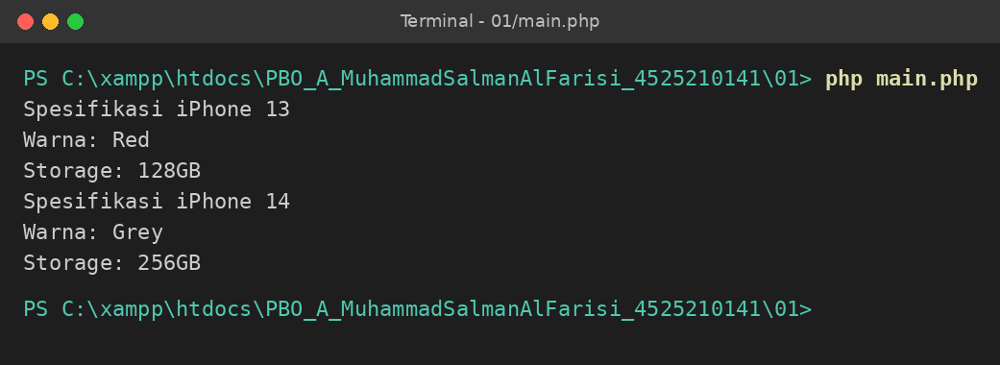
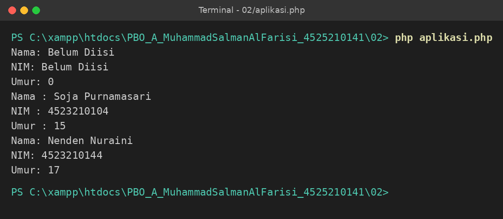
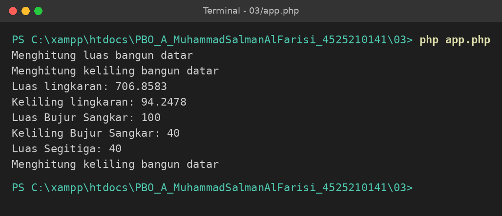
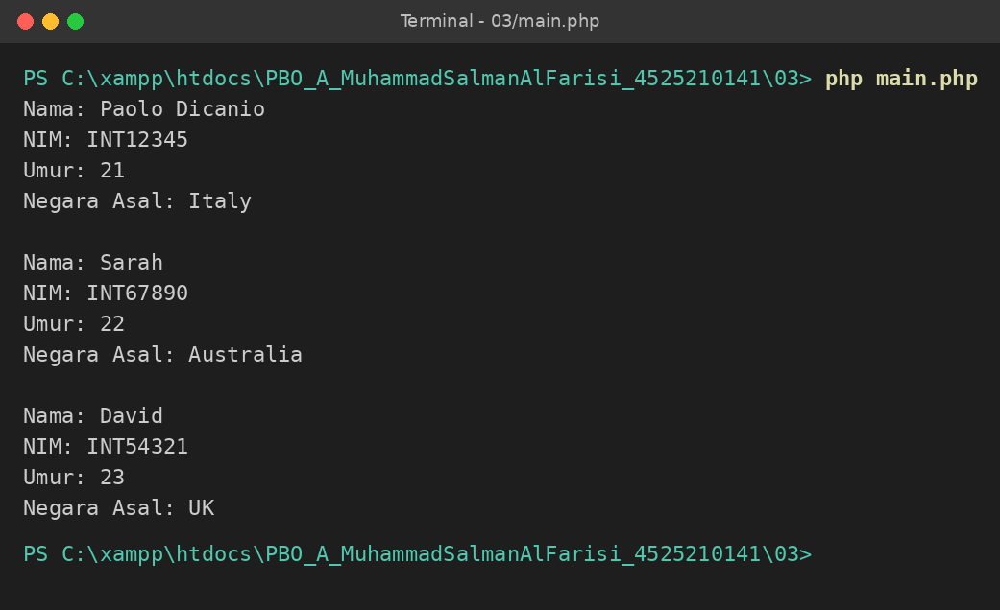
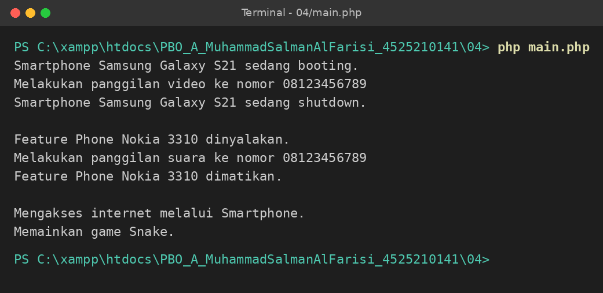
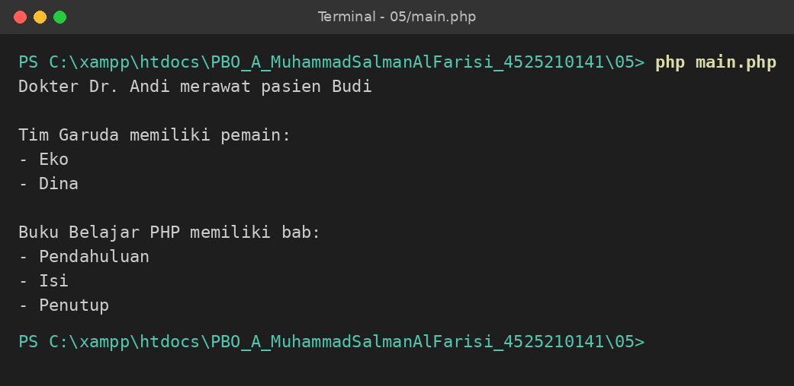
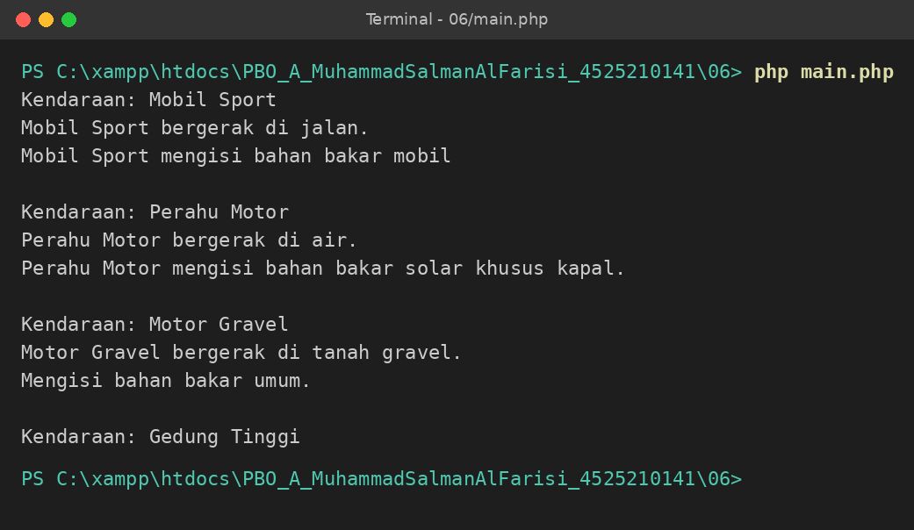

# Tugas 1 PBO - Convert Java ke PHP

Nama : Muhammad Salman Al Farisi  
NIM  : 4525210141  
Kelas: PBO A

Tugas konversi source code Java pertemuan 01 sampai 06 ke bahasa PHP.

Source code asli (Java): https://github.com/adiwp/pbo20192020II/tree/master/gasal20242025

## Isi

| Folder | Materi |
|---|---|
| [01](01) | Class dan Object |
| [02](02) | Constructor |
| [03](03) | Inheritance |
| [04](04) | Polymorphism |
| [05](05) | Asosiasi, Agregasi, Komposisi |
| [06](06) | Abstract Class dan Interface |

## Cara menjalankan

Pakai PHP CLI (dites di PHP 8.3). Masuk ke foldernya lalu jalankan file utamanya, contoh:

```
cd 01
php main.php
```

## Hal yang berbeda antara Java dan PHP

Beberapa bagian tidak bisa dipindah langsung dari Java, jadi disesuaikan:

- **Constructor overloading** (02, 03): PHP hanya boleh satu `__construct()`, jadi dipakai parameter dengan nilai default.
- **Default method di interface** (06): PHP tidak punya, diganti dengan trait.
- **Tipe data dan `main()`**: PHP tidak perlu deklarasi tipe dan tidak butuh method `main`, file utamanya cukup dijalankan langsung.
- **Sintaks**: `this.` jadi `$this->`, `super()` jadi `parent::`, `+` untuk string jadi `.`, `System.out.println` jadi `echo`.

Penjelasan lengkap tiap pertemuan ada di README masing-masing folder.

## Hasil Output

### Pertemuan 01 - Class dan Object

Output



### Pertemuan 02 - Constructor

Output



### Pertemuan 03 - Inheritance

Output app.php (bangun datar)



Output main.php (mahasiswa)



### Pertemuan 04 - Polymorphism

Output



### Pertemuan 05 - Asosiasi, Agregasi, dan Komposisi

Output



### Pertemuan 06 - Abstract Class dan Interface

Output


